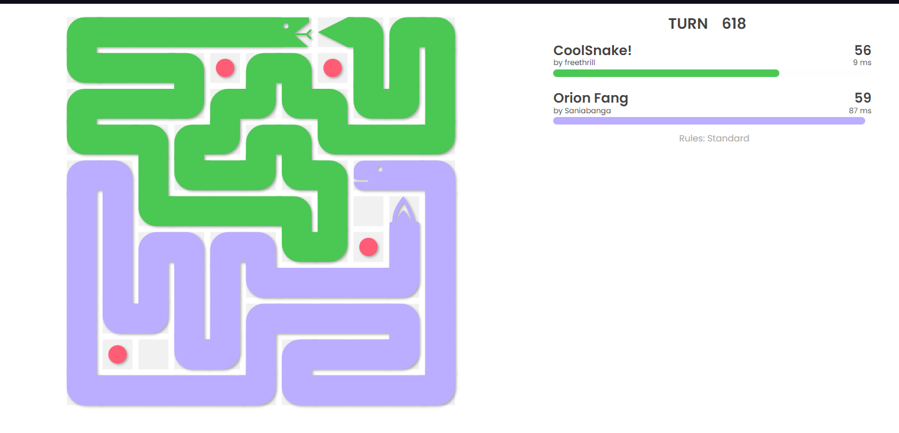
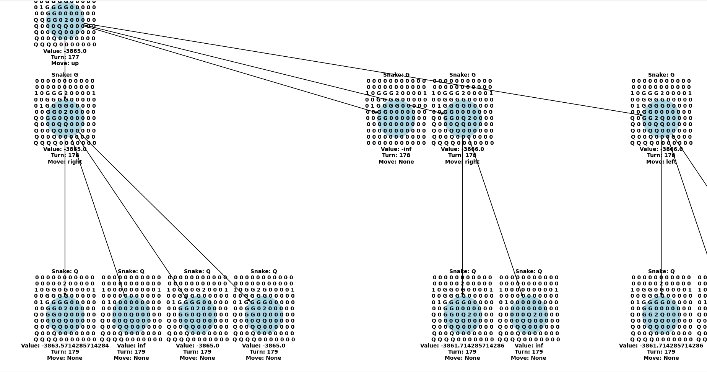

# Minimax BattleSnake Ai built with Python

- Snake built for the 2023 spring RBC BattleSnake competition, second place winner
- Reached 16th in global standard ladder and 17th in duels
- Snake uses paranoid Minimax algorithm with alpha-beta pruning for decision making, allowing the Ai to have up to 7 steps look ahead
- Behavior is determined by heuristics, such as using flood fill to score each possible outcome

# About Snake
- The name of the snake is Orion's Fang, inspired by the Orion constellation
- Orion's Fang is an aggressive but rational snake, quite experienced in area control and edge killing
- Can often overthink and panic, killing itself in the process

> Orion's Fang showing his area control capabilities against CoolSnake!

# Debugging Process
- Debugging the Minimax decision tree using simple debuggers proved to be a nightmare, so it was decided that a visual representation of the tree was needed
- The visual decision tree given a game state, render all possible game state of each snakes up to the max depth 
- The game boards are displayed as board with 0 being empty cells, 1 being food, 2 being snake head and letters to represent snake body
- Each possible game state is assigned a value and a chosen move which will be moved upwards for the root game state to choose

> The visual tree at depth 2

# Technology used
 - Coded with Python 3, libraries such as Matplotlib and Networkx were used for creating the visual decision tree
 - Deployed using DigitalOcean

